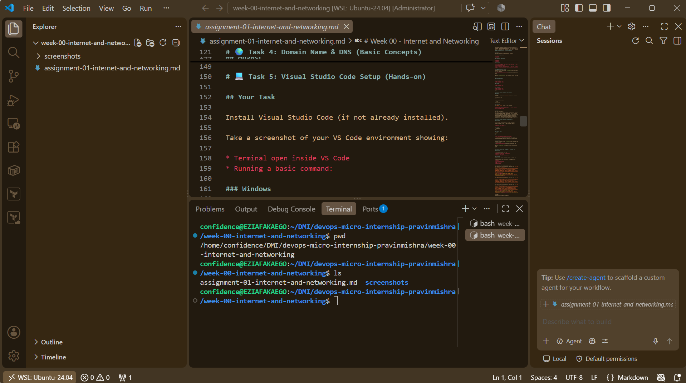

# Week 00 - Internet and Networking

Part of the DevOps Micro Internship (DMI) with Agentic AI

---

# 🧑‍💻 Task 1: Using ChatGPT as Your Learning Assistant

## Scenario

You're new to DevOps and will frequently encounter technical questions. ChatGPT can be your learning companion.

## Your Task

Write a clear ChatGPT prompt to help you understand:

> "What is a protocol in networking? Explain with a simple real-life example."

Take a screenshot of your interaction showing:

* Your detailed prompt (with clear expectations)
* ChatGPT's simplified response with an example

## Screenshot

Save your screenshot in the `screenshots` folder and update the file name below.


Replace `task-1-chatgpt.png` with your actual screenshot file name.

---

## What I Learned (2–3 lines)

Add your answer here...

A protocol is basically a set of rules that devices follow to communicate with each other on a network.
It’s like a common language that helps computers know how to send and receive data.

# 🌐 Task 2: Internet and Networking

## Scenario

Your friend is launching an online bookstore named **EpicReads**.

He asked you to explain how users globally can access his website hosted in Finland.

## Your Task

Write a short explanation (**100–150 words**) that includes:

* Packet Switching
* IP Address
* TCP/IP
* HTTP/HTTPS

💡 **Tip:** You may use ChatGPT (as demonstrated in Task 1) to refine your explanation.

## Answer

Add your answer here...

When a user accesses EpicReads from anywhere in the world, several networking processes happen. Packet switching breaks the website's data into smaller packets, which routers forward across networks toward the user's device. Each device involved in communication uses an IP address to identify the source and destination of packets. TCP helps ensure that the packets arrive reliably and in the correct order, retransmitting missing packets when necessary. HTTP is a protocol used by the browser and web server to communicate and exchange web resources. HTTPS is the secure version of HTTP. It uses encryption to protect information travelling between the user's browser and EpicReads, such as login details and passwords. Together, these networking technologies allow users around the world to communicate with and access websites such as EpicReads.

# 🏗️ Task 3: Application Architecture & Stack

## Scenario

EpicReads bookstore has two application versions:

### Two-Tier Application

* Frontend
* Database

### Three-Tier Application

* Frontend
* Backend
* Database

## Your Task

* Draw simple diagrams (hand-drawn or tool-based such as draw.io)
* Label each layer clearly
* List at least two common technologies or tools used for each layer
* Submit a screenshot or photo clearly showing your own drawing

## Diagram Screenshot / Photo

Save your diagram image in the `screenshots` folder and update the file name below.


Replace `task-3-diagram.png` with your actual diagram file name.

---

## Technologies Used

### Frontend

* Next.js (React framework for server-side rendering and routing)
* Tailwind CSS(For styling)

### Backend

* Node.js & Express.js(For API development)
* JWT(For user authentication)

### Database

* MySQL (For storing application data)
* Sequelize (For database management and interaction with MySQL)

---

# 🌍 Task 4: Domain Name & DNS (Basic Concepts)

## Scenario

Your friend's bookstore **EpicReads** is currently accessible through:

```text
52.172.142.222:3000
```

He purchased the domain:

```text
epicreads.com
```

## Your Task

In **50–100 words**, explain in your own words:

1. What is DNS (Domain Name System)?
2. Which DNS record type should be used to connect the domain to the given IP, and why?

## Answer

Add your answer here...

DNS (Domain Name System) is like the phonebook of the internet. It translates human-readable domain names, such as epicreads.com, into IP addresses that computers use to locate servers. An A record should be used to connect EpicReads to 52.172.142.222 because an A record maps a domain name to an IPv4 address. Therefore, the DNS configuration would point epicreads.com to 52.172.142.222. The :3000 is a port number, not part of the IP address, so it is not included in the A record.

# 💻 Task 5: Visual Studio Code Setup (Hands-on)

## Your Task

Install Visual Studio Code (if not already installed).

Take a screenshot of your VS Code environment showing:

* Terminal open inside VS Code
* Running a basic command:

### Windows

```powershell
dir
```

### Linux / macOS

```bash
pwd
ls
```

* Your selected VS Code theme clearly visible

⚠️ **Important:** The screenshot must show your username or another identifiable detail to confirm it is your environment.

## Screenshot

Save your screenshot in the `screenshots` folder and update the file name below.




Replace `task-5-vscode.png` with your actual screenshot file name.

---

# 🔗 Task 6: Publish Your Assignment as a LinkedIn Post

## Objective

Publishing on LinkedIn helps you:

* Build your professional online presence
* Reinforce your learning
* Document your DevOps journey publicly

## Your Task

Summarize your answers from Tasks 1–5 into a LinkedIn post.

Clearly structure your post into the following sections:

* ChatGPT
* Internet & Networking
* App Architecture
* DNS
* VS Code Setup

Use the credit note that matches your track:

Add the following credit note at the end of your post **(If you are DMI Cohort 3 student)**:

> **P.S. This post is part of the DevOps Micro Internship (DMI) with Agentic AI — Cohort 3 — by Pravin Mishra. My graded progress is public: https://dmi.pravinmishra.com/s/YOUR-GITHUB-USERNAME.html · Start your DevOps journey: https://dmi.pravinmishra.com/?utm_source=student&utm_medium=ps-linkedin&utm_campaign=cohort3**

**Tag [Pravin Mishra](https://www.linkedin.com/in/pravin-mishra-aws-trainer/) in your LinkedIn post, then tag Lead Co-Mentor — [Anjana Muthunayake](https://www.linkedin.com/in/anjana-muthunayake/).**

Add the following credit note at the end of your post **(If you are DMI Self-paced track student)**:

> **P.S. This post is part of the DevOps Micro Internship (DMI) — Self-Paced Engineer Track — by Pravin Mishra. My graded progress is public: https://dmi.pravinmishra.com/s/YOUR-GITHUB-USERNAME.html · Start your DevOps journey: https://dmi.pravinmishra.com/?utm_source=student&utm_medium=ps-linkedin&utm_campaign=self-paced**

Add the following credit note at the end of your post **(If you are DMI Campus student)**:

> **P.S. This post is part of the DevOps Micro Internship (DMI) — Campus — by Pravin Mishra. My graded progress is public: https://dmi.pravinmishra.com/s/YOUR-GITHUB-USERNAME.html · Start your DevOps journey: https://dmi.pravinmishra.com/?utm_source=student&utm_medium=ps-linkedin&utm_campaign=campus**

**Tag [Pravin Mishra](https://www.linkedin.com/in/pravin-mishra-aws-trainer/) in your LinkedIn post, then tag Lead Co-Mentor — [Anjana Muthunayake](https://www.linkedin.com/in/anjana-muthunayake/).**

Hashtags:

#DMIByPravinMishra #AgenticAI #DevOps

Replace `YOUR-GITHUB-USERNAME` with your GitHub username — that link is your public DMI progress page (your graded badge page).
---

## LinkedIn Post URL

Paste your LinkedIn post URL here:

```text
Add your URL here...
```

---

## LinkedIn Post Backup Copy

Paste the full text of your LinkedIn post here:

Add your post content here...

---

# Reflection – Week 0

### What did you find easy?

Add your answer here...

prompting Chatgpt for the defintion of a protocol in networking and Explaining what protocol entails using a simple real-life example. 

### What was difficult?

Add your answer here...

Hand drawing 2tier and 3tier Architecture;i got confused at some point.

### What will you improve next week?

Add your answer here...

i will try to pay attention to little details, and try to get a deep understanding a problem before checking for solution.

## 📌 About DMI & CloudAdvisory

DevOps Micro Internship (DMI) is a project-based DevOps program run by Pravin Mishra (The CloudAdvisory) focused on real-world execution, systems thinking, and career readiness.

It helps learners build strong DevOps foundations with hands-on experience.


## 📌 Resources

- 🌐 **DMI Official Website:** https://dmi.pravinmishra.com?utm_source=github&utm_medium=readme  
- 🎓 **University:** https://university.pravinmishra.com?utm_source=github&utm_medium=readme  
- 💬 **Discord Community:** https://discord.pravinmishra.com?utm_source=github&utm_medium=readme  
- 📝 **Blog:** https://dmi.pravinmishra.com/blog?utm_source=github&utm_medium=readme  
- ▶️ **YouTube Playlist (DMI Cohort 3):** https://www.youtube.com/playlist?list=PLFeSNDtI4Cho  
- 🔗 **Pravin Mishra (LinkedIn):** https://www.linkedin.com/in/pravin-mishra-aws-trainer/  
- 🏢 **CloudAdvisory (LinkedIn):** https://www.linkedin.com/company/thecloudadvisory/

---

*This submission is part of DevOps Micro Internship (DMI) — Agentic AI Track*
